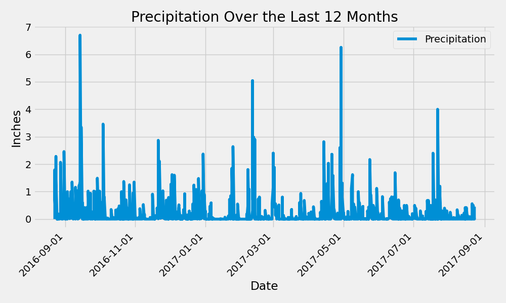
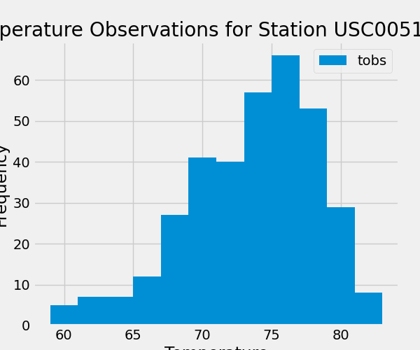

# sqlalchemy-challenge

In  this challenge, we are using SQLAlchemy to connect and reflect and query the hawaii.sqlite databse. We are also linking Python to the database by creating a SQLAlchemy session.

## Part 1: Analyze and Explore the Climate Data

### Precipitation Analysis

I found the most recent date in the dataset and utilizing functions from datetime library to get the date of the previous year. Then I am able to query the previous 12 months of precipitation data with the date filter in place.

I created a Pandas DataFrame with date and precipitation as columns. After sorting the dataframe by "date", I was able to plot the required chart shown below:

I then used the Pandas describe function to print the summary statistics for the precipitation data.

### Station Analysis

I designed a query to calculate the total number of stations in the dataset and a query to find the most-active stations by listing the stations and obvervation counts in descending order. The station with the max count is the most active one. 

I then designed a query that calculates the lowest, highest, and average temperatures that filters on the most-active station id found in the previous query.

Then I drew a histagram using the temprature data of the previous 12 months of the most active station. 

Plot the results as a histogram with bins=12, as the following image shows:

## Part 2: Design Your Climate App

I used Flask to create the 6 required routes as follows:

### A homepage that lists all the available routes.

### /api/v1.0/precipitation

Convert the query results from your precipitation analysis (i.e. retrieve only the last 12 months of data) to a dictionary using date as the key and prcp as the value.

Return the JSON representation of your dictionary.

### /api/v1.0/stations

Return a JSON list of stations from the dataset.

### /api/v1.0/tobs

Query the dates and temperature observations of the most-active station for the previous year of data.

Return a JSON list of temperature observations for the previous year.

### /api/v1.0/<start> and /api/v1.0/<start>/<end>

Return a JSON list of the minimum temperature, the average temperature, and the maximum temperature for a specified start or start-end range.

For a specified start, calculate TMIN, TAVG, and TMAX for all the dates greater than or equal to the start date.

For a specified start date and end date, calculate TMIN, TAVG, and TMAX for the dates from the start date to the end date, inclusive.

